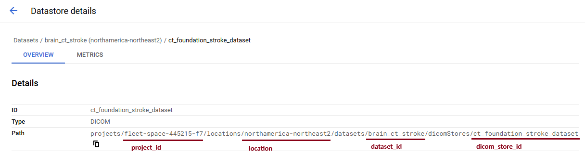

# CT Foundation Brain

Test the CT foundation model for brain CT and QA purposes

## Google Cloud sign-in
To connect to the google dicom storage and CT Foundation API, one must sign in to the google account using command line.

First run `gcloud init` when the container starts, skip sign in when asked. 

Then run `gcloud auth application-default login` and follow the prompt to sign in.

To verify the signing in, run `gcloud beta auth application-default print-access-token` and the console should return an access token. 

## Demos

- `load_lidc_embeddings`: test access to the stored embeddings precomputed for the LIDC datasets on Google Cloud.
- `process_dicom_from_example_storage`: test access to the stored dicom data shared by google and execute the CT foundation API
- `upload_dicom`: Upload the dicom to Google cloud dicom storage
- `process_dicom_from_own_storage`: test access to the uploaded dicom data and execute the CT foundation API

## Set up dicom store in Google Cloud

To setup with dicom store, follow the instructions from Google: `https://cloud.google.com/healthcare-api/docs/how-tos/dicom`

The project_id, location, dataset_id, and dicom_store_id can be found from the dicom store overview under `path`, as shown in the following screenshot:

